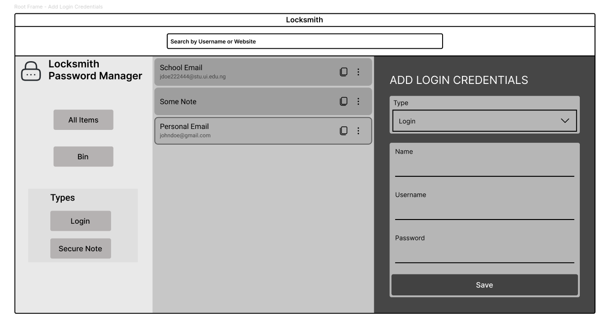
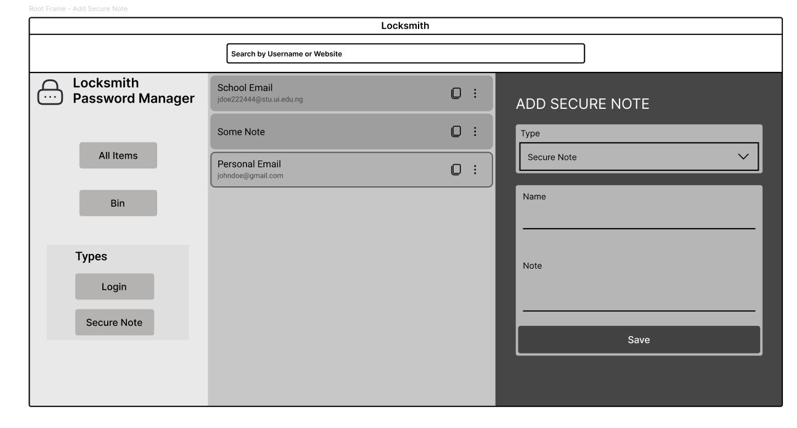
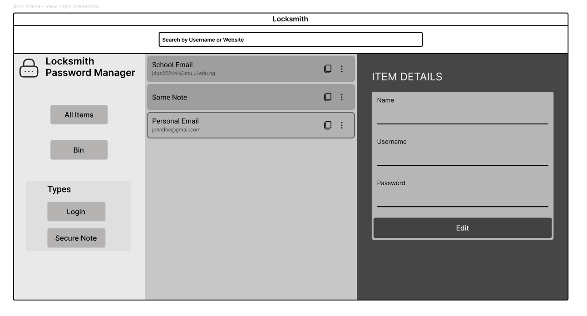

# Locksmith 
A custom password manager app made entirely in Python

### Aims & Objectives
1. Demonstrate functional programming techniques
2. Make use of Python's inbuilt Tkinter module to create a pleasant User Interface
3. Ace CSC 103 😗

# Figma UI designs
#### (not to be strictly followed!, just a yardstick)

![View 4]](image-3.png)